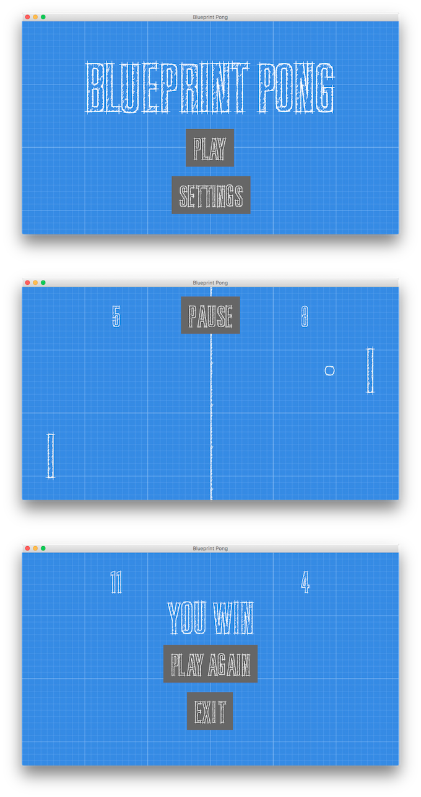

# Blueprint Pong
[](https://travis-ci.org/vanillaSlice/BlueprintPong)

This is a Pong clone written using libGDX.

## Screenshot


## Running the project

### Running the desktop project

```
./gradlew desktop:run
```

This compiles the core and desktop project, and runs the desktop starter.

### Running the Android project

```
./gradlew android:installDebug android:run
```

This task will create a debug APK of the application, install it on the first connected emulator or device and start the
main activity.

## Instructions
You are the paddle on the left. On desktop, use arrow keys to move the paddle or click where you want the paddle to move
to. On Android devices, touch the screen where you want the paddle to move to. First player to 11 wins.

## Useful Links
Resources useful for the completion of this project:

* [libGDX](https://libgdx.badlogicgames.com/) (cross-platform game development framework)
* [Gradle](https://gradle.org) (for building and dependency management)
* [Font](http://www.fontspace.com/kc-fonts/bluprint) (the font used in the game is Bluprint font created by KC Fonts)
